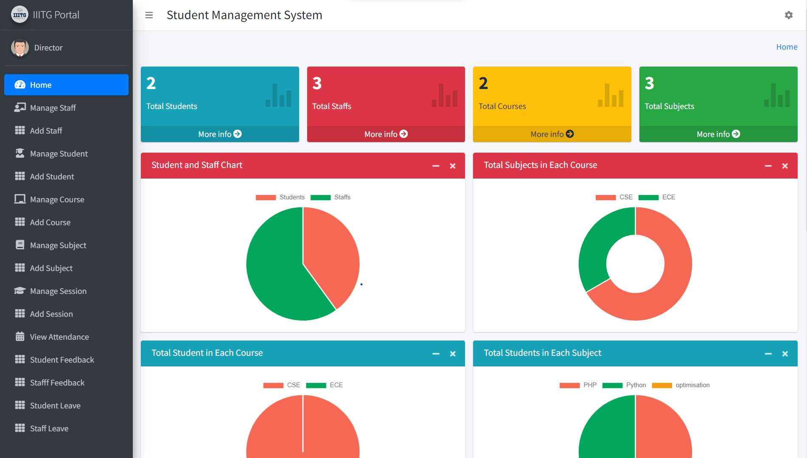

# IIITG PORTAL

**IIITG PORTAL** is a web-based student management system built with Node.js, Express.js and MongoDB which is designed to cater to the needs of Directors, Teachers, Students, and Office Staff within an educational institution.

## Features

### Director
- View details of staff and students.
- Manage courses and staff.
- Address complaints.

### Teacher
- Add and manage student results.
- Take attendance.

### Student
- View attendance records.
- Check results.
- Raise complaints.

## Getting Started

To set up the **IIITG PORTAL** system, follow these steps:

1. **Clone or Download:** Begin by cloning this repository to your local machine or downloading the project's source code.

2. **Install Dependencies:** Open a command prompt within the project folder and run the command `npm install` to install the necessary dependencies. You can also use `npm update` if needed.

3. **Start the Server:** Run the following command to start the server:
```sh
$ cd student-management-system
$ npm install
$ nodemon
```

## Import User Data

To populate the **IIITG PORTAL** system with user data, you can use the following command to import user information into the local MongoDB server:

```sh
$ mongoimport --db student-mgmt-sys --collection users --file users.json
```

# Screenshots

### Login


## Director

### Dashboard


### Manage Courses


### Manage Staff


### Complaints


## Teacher

### Dashboard


### Take Attendance


### Add Result


## Student

### Dashboard


### View Result


### View Attendance


